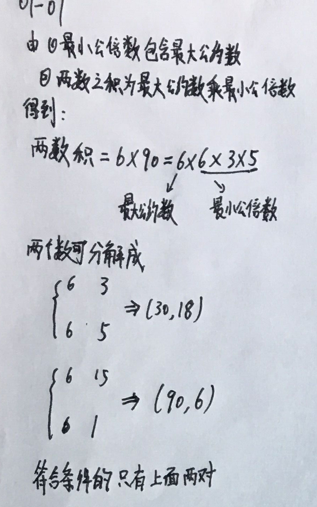
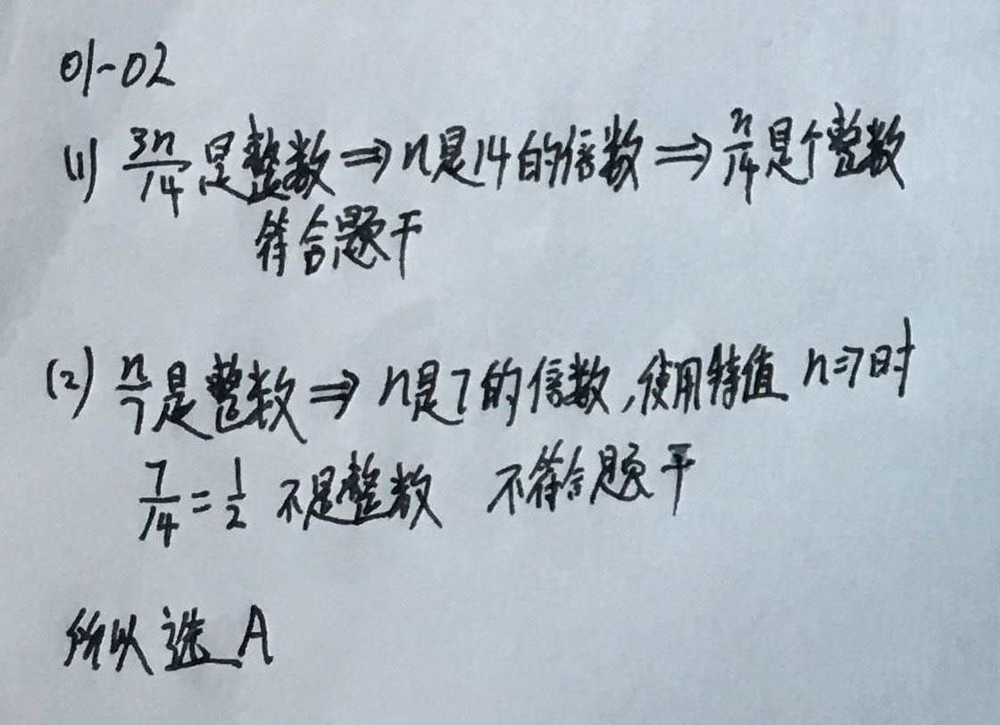
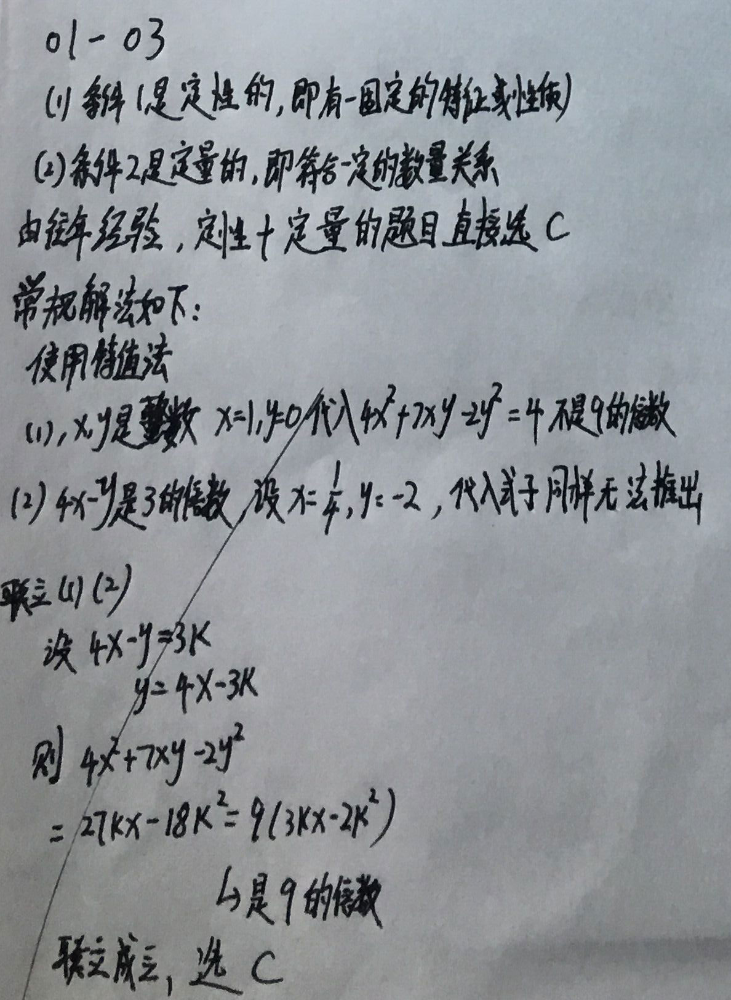
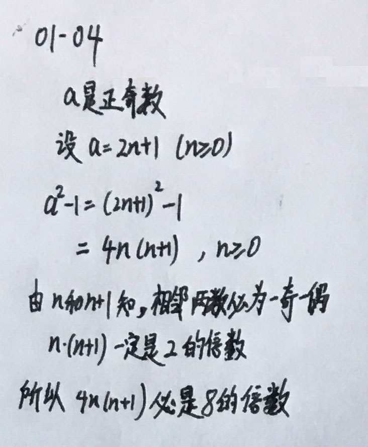

### __什么是条件充分性判断__
> 两个数学命题 A、 B， 若由条件 A 成立， 就可以推出结论 B 成立 （ 即 A B 是真命题），则 A 是 B 的充分条件， 即 A 具备了使 B 成立的充分性。 若由 A 不能推出 B， 则称 A 不是 B的充分条件， 即 A 不具备使 B 成立的充分性。
>
> 简单的说就是 若 A => B 成立， 那么A是B的充分条件。(小范围=>大范围)

### __常用解题方法__
- 自下而上 ：<br>
  将条件中的参数分别代入题干中验证。 特点是至少运算两次。(通过给定条件推结论，有时候常见于代入法。)
- 自上而下 ：<br>
  先不看条件， 假设题干中命题正确， 求出参数。 然后将条件中参数范围与题干成立的参数范围进行比较， 若条件范围落入题干成立范围之内， 则充分。 特点是一次运算。

---

### __算术部分__
- 整数: <br>
  ① 第一种分法： 负整数， 0， 正整数<br>
  ② 第二种分法： 偶数(2n)，奇数(2n±1) ; （n∈Z） 备注：相邻两数必为一奇一偶<br>

- 自然数: <br>
   0 和 正整数

- 正整数: <br>
  1， 质数(也称素数，只有1和自身两个约数) ， 合数(除1和自身还有其他约数)
  备注： 其中2是唯一偶质数也是最小质数。

- 实数:<br>
  有理数 和 无理数

- 有理数：可化为分数的数都可成为有理数 n/m <br>
  ① 第一种分法： 整数 ， 分数 <br>
  ② 第二种分法： 整数 ， 有限小数 ， 无限循环小数 <br>

- 分数: <br>
  由上可知包含： 有限小数，无限循环小数

- 纯循环小数的一些规律: <br>
  ```code
   0.3 = 3/9
   0.121212... = 12/99
   0.234234... = 234/999
  ```

- 有理数，无理数之间的运算规则：<br>
  ① 有理数(＋－×÷)有理数，仍为有理数。（ 注意， 此处要保证除法的分母有意义，非0）<br>
  ② 无理数(＋－×÷)无理数， 有可能为无理数， 也有可能为有理数 <br>
  ③ 有理数(＋－)无理数=无理数，非0有理数(×÷)无理数=无理数 <br>

- 常用无理数: <br>
  ```code
   √2 ≈ 1.414
   √3 ≈ 1.732
   √5 ≈ 2.24
   √6 ≈ 2.45
  ```

- 整数部分和小数部分: <br>
  整数部分是指一个数减去一个整数后， 所得的差大于等于零且小于 1， 那么此减数是整数部分， 差是小数部分。
  举例 ： -√5 的整数部分是-3，小数部分是3-√5

- 30以内的10个质数：<br>
  ```code
  2,3,5,7,11
  13,17,19,23,29
  ```

- 考题举例: <br>
  一个三角形，三个内角和是180度，三个内角都为质数，则必有一角是 ( A )  <br>
  A. 2　　B. 13　　 C. 17　　D. 19　　E. 23　<br>
  解析技巧：由于 奇数+奇数+奇数 ≠ 180° ，所以必须要有一个偶数，答案选 A. 2

- 其他拓展: <br>
 {m,n} 有两种意思，一种是集合(无序的)，一种是数对(有序的)

### __关于运算中的一些规律和推论__
- 已知a,b有理，λ无理，a + λb = 0 推出 a = b = 0

- 相邻两数中必有一奇一偶

- 正整数可分为：质数(只有1和它本身两个约数)和合数(除了1和它本身还有其他的约数)

- 2是最小的偶质数，4是最小合数

- 1既不是质数也不是合数

- 30以内的质数：共10个，这样记忆
 ```
    2 3 5 7
    11 13 17 19
    23 29
 ```

### __数字的整除特征__
- 能被2整出的数：个位为：0，2，4，6，8
- 能被3整出的数：各位数字之和必能被3整除
- 能被4整出的数：末两位(各位和十位)数字也必能被4整除。
- 能被5整出的数：各位为0或5
- 能被6整出的数：同时满足能被2和3整除的条件
- 能被8整出的数：末三位(个位，十位和百位) 数字必能被8整除
- 能被9整出的数：各位数字之和必能被9整除。
- 能被10整出的数：个位必为0

---

### __公约数、公倍数、互质__
- 约数：设 a 为一个正整数 ,m 为 a 的一个约数是指：a 能被正整数 m 除尽，如 a=15,
  则 a=3× 5，所以 a 有约数 1，3，5，15 共 4 个。

- 公约数: 若正整数 m 同时是几个正整数 A,B,C...H 的约数，就称 m 是 A,B,C...H 的公约数，并把
  A,B,C...H 的公约数中的最大的称为最大公约数。

- 公倍数: 若正整数 n 同时是几个正整数 M,N,O...Z 的倍数，就称 n 是  M,N,O...Z 的公倍数，并把
   M,N,O...Z 的公倍数中最小的称为最小公倍数。 <br>
  注意：如何求两个数的最大公约数和最小公倍数：短除法。<br>
  定理：两个整数的乘积等于他们的最大公约数和最小公倍数的乘积。<br>
  其中：最大公约数为两数所有。<br>

- 互质:若正整数 m 与正整数 n 的公约数只有 1，就称这两个正整数 m 与 n 互质，并称 n/m 为既约分数 (最简分数)
  备注：但互质的两数无需为质数。<br>

### __一些相关定理和规律__
- 两数乘积 = 最大公约 * 最小公倍数
- 最小公倍数包含最大公约数
- 最小公倍数比最大公约数多的部分分到两数当中
- 例如：60 和 84， 60 = 2*2*3*5； 84 = 2*2*3*7； 最大公约数是：2*2*3， 最小公倍数是：2*2*3*5*7， 最小公倍数比最大公约数多的部分5和7被
分到两数之中，组成两数。

### __相关例题解析__
- __例01-01：两正数最大公约数为6，最小公倍数为90， 满足正整数大数在前的数对有多少？<br><br>__

<div align=center>
  <span>解析过程如下图：</span> <br><br>
  
</div>

---

### __实数的性质和运算__
- 实数的基本性质：<br>
  1. 实数与数轴上的点一一对应。
  2. 实数可进行比较运算且结果唯一：若 a,b 是任意两个实数，则在 `a<b , a=b , a>b` 中有且只有一个关系成立。
  3. 实数平方具有非负性：若 a 是任意实数,则 a^2 >=0 (备注： a^2 表示 a*a)

- 实数的运算
  说明：实数的四则运算满足加法和乘法运算的交换律、结合律和分配律。 还可以定义实数的乘方和开方运算。
  1. 乘方运算: <br>
  a^m * a^n = a^(m+n) <br>
  a^m / a^n = a^(m-n) <br>
  (a*b)^n = a^n * b^n <br>
  (a/b)^n = a^n / b^n <br>
  (a^m)^n = a^(m*n) <br>
  当a ≠ 0 时, a^0 = 1 , a^(-n) = 1/(a^n)

  2. 开方运算: <br>
  在实数范围内，负实数无偶次方根；<br>
  0 的偶次方根是 0； <br>
  正实数的偶次方根有两个，且互为相反数，其中正的偶次方根称为算术根。 <br>
  如：当 a>0 时，a 的平方根是±√a ，其中√a是正实数 a 的算术平方根。 <br>
  任何非零实数的零次幂等于1。<br>
  负实数奇次幂是负数：(-2)^3 = -2^3 = -8。<br>
  
  3. 平方运算(乘方运算的一种)：2^2 = 4, (-2)^3 = -8 <br>

  4. 分母有理化: <br>
  有理化：把无理的东西变成有理。<br>
  有理化因式：两个含有二次根式的代数式相乘，如果它们的积不含二次根式，那么这两个代数式
  互为有理化因式（一个二次根式的有理化因式不唯一）。如√2的有理化因式为√2，√2+√3的有
  理化因式为√2-√3 <br>
  分母有理化：去掉分母中的根号，将分子分母同时乘以分母的有理化因式。<br>
  
  5. 裂项相消法：常用于当题干中出现多个分数求和的情况:<br>
  1/n*(n+1) = 1/n - 1/(n+1) <br>
  1/n*(n+k) = 1/k * (1/n - 1/(n+k))

### __相关例题解析__
- __例01-02： n/14是一个整数<br><br>__
(1) n是一个整数，且3n/14也是个整数<br>
(2) n是一个整数，且n/7也是一个整数<br>

<div align=center>
  <span>解析过程如下图：</span> <br><br>
  
</div>
<br>

- __例01-03： 4x^2 + 7xy -2y^2 是9的倍数<br><br>__
(1) x,y是整数。<br>
(2) 4x-y是3的倍数。<br>

<div align=center>
  <span>解析过程如下图：</span> <br><br>
  
</div>
<br>

- __例01-04：设a是正奇数，则a^2 - 1 必是：C <br><br>__
A. 5的倍数       B. 6的倍数      C. 8的倍数      D. 9的倍数

<div align=center>
  <span>解析过程如下图：</span> <br><br>
  
</div>