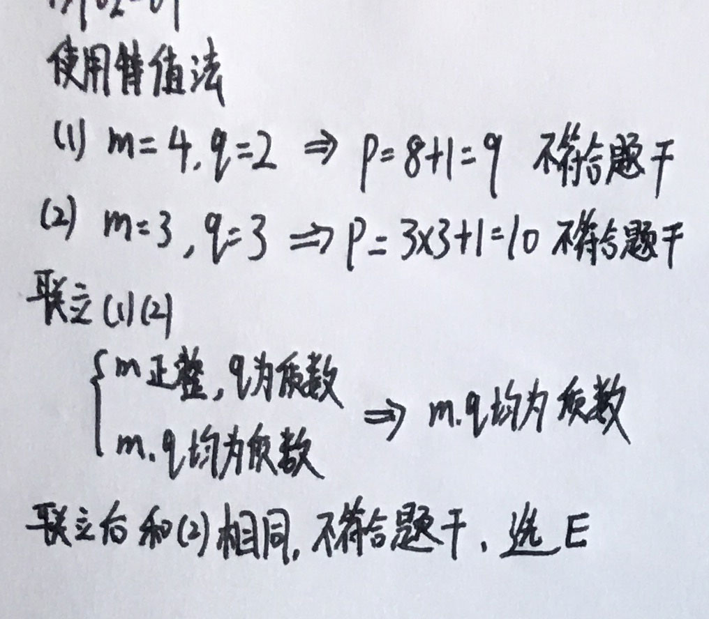
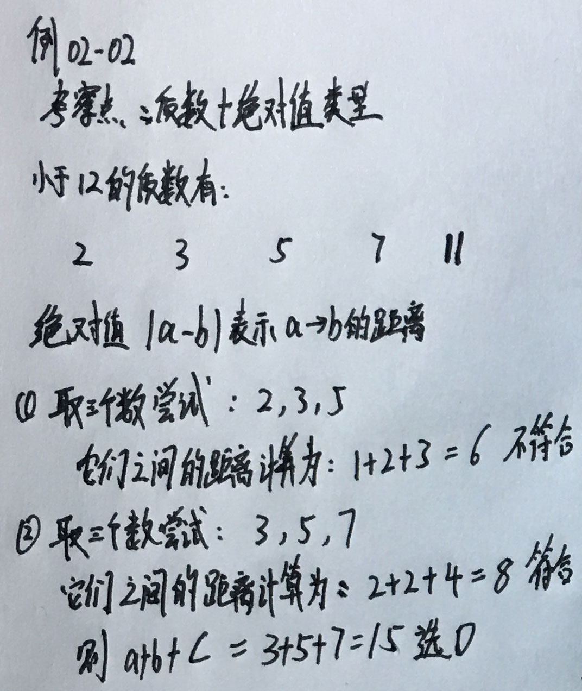
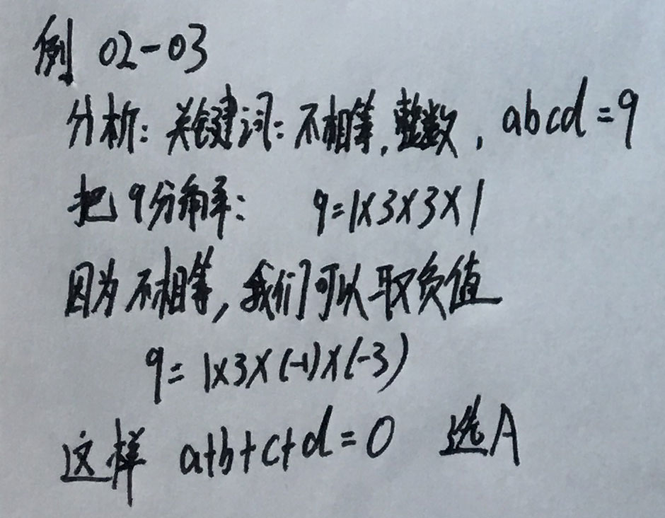
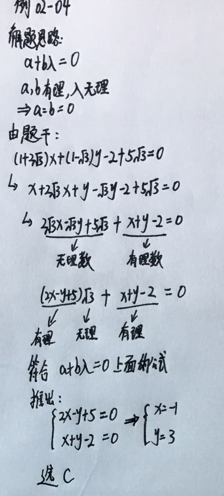
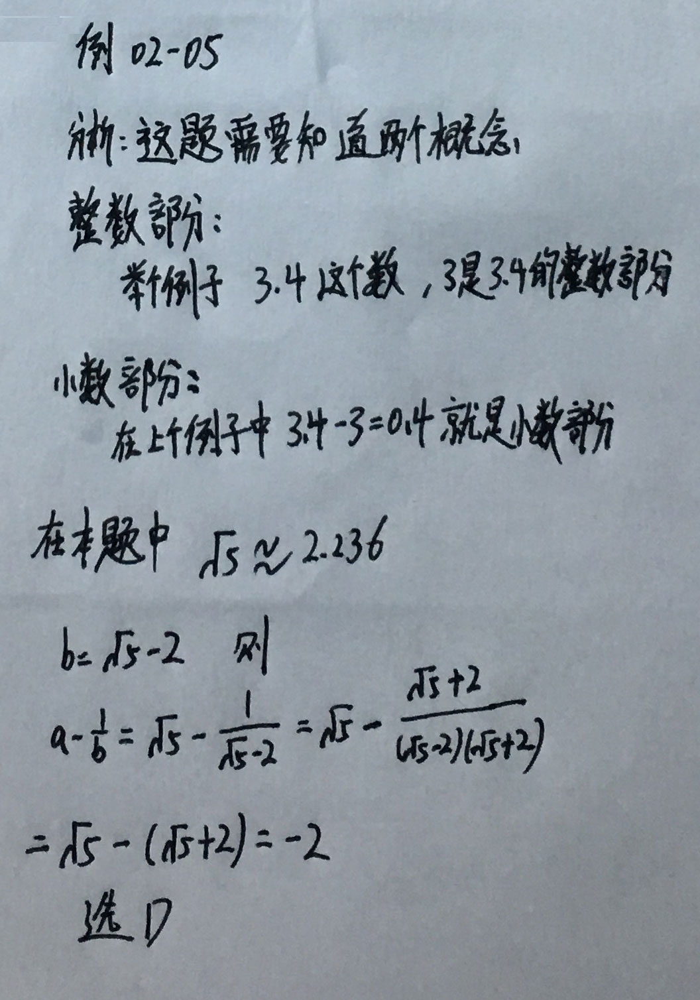

### __相关习题训练__

__例02-01：p = mq + 1 为质数__  
(1) m为正整数，q为质数  
(2) m,q均为质数 

  解析过程如下图：   
  

 

__例02-02：设a,b,c是小于12的三个不同质数(素数). 且 |a-b| + |b-c| + |c-a| = 8, 则a+b+c=多少__  
A. 10        B.12        C.14        D.15        E.19

  解析过程如下图：   
  

 

__例02-03：有四个不相等的整数a,b,c,d,且abcd=9,则a+b+c+d=?__  
A. 0        B.1        C.4        D.6        E.8

  解析过程如下图：   
  

 

__例02-04：若x,y是有理数，且满足(1+2√3)x + (1-√3)y - 2 + 5√3 = 0, 则x，y的值分别为？__  
A. 1,3        B.-1,2        C.-1,3        D.1,2        E.以上结论均不正确

  解析过程如下图：   
  

 

__例02-05：把无理数√5记作a, 它的小数部分记作b, 则a-1/b等于__  
A. 1        B.-1        C.2        D.-2        E.以上答案均不正确

  解析过程如下图：   
  

 