### __相关习题训练__

__例02-01：p = mq + 1 为质数__  
(1) m为正整数，q为质数  
(2) m,q均为质数 

  解析过程如下图：   
  

 

__例02-02：设a,b,c是小于12的三个不同质数(素数). 且 |a-b| + |b-c| + |c-a| = 8, 则a+b+c=多少__  
A. 10        B.12        C.14        D.15        E.19

  解析过程如下图：   
  

 

__例02-03：有四个不相等的整数a,b,c,d,且abcd=9,则a+b+c+d=?__  
A. 0        B.1        C.4        D.6        E.8

  解析过程如下图：   
  

 

__例02-04：若x,y是有理数，且满足(1+2√3)x + (1-√3)y - 2 + 5√3 = 0, 则x，y的值分别为？__  
A. 1,3        B.-1,2        C.-1,3        D.1,2        E.以上结论均不正确

  解析过程如下图：   
  

 

__例02-05：把无理数√5记作a, 它的小数部分记作b, 则a-1/b等于__  
A. 1        B.-1        C.2        D.-2        E.以上答案均不正确

  解析过程如下图：   
  

 

### __比与比例的定义__

- 比：两个数相除，称为这两个数的比，即a:b=a/b, 相除所得的商叫做比值，记作 a:b=a/b=k。 在实际应用中常将比值用百分数表示，称为百分比。
- 比例：相等的比，称为比例, 记作：a:b=c:d 或 a/b = c/d. 其中a和d称为比例外项，b和c称为比例内向。
- 当a:b=b:c时，称b为a和c的比例中项，显然当a,b,c均为正数时，b是a和c的几何平均值。
- 正比： 若y=kx（k不为0），则称y与x成正比，k称为比例系数。
- 反比： 若y=k/x（k不为0），则称y与x成反比，k称为比例系数。

### __比与比例的性质__
- 比的基本性质： a:b = k <=> a = kb; a:b = ma:mb (m≠0)
- 比例的基本性质：a:b = c:d <=> b:a = d:c <=> b:d = a:c <=> d:b = c:a

### __比例的基本定理__
- 更比定理： a/b = c/d <=> a/c = b/d
- 反比定理： a/b = c/d <=> b/a = d/c
- 合比定理： a/b = c/d <=> (a+b)/b = (c+d)/d
- 分比定理： a/b = c/d <=> (a-b)/b = (c-d)/d
- 等比定理： a/b = c/d = e/f => (a+c+e)/(b+d+f) = a/b(b+d+f≠0)

### __相关例题__

__例02-06：若(a+b-c)/c = (a-b+c)/b = (-a+b+c)/a = k, 则k的值为：__  
A. 1       B.1或-2        C.-1或2        D.-2        E.以上选项均不正确

  解析过程如下图：   
  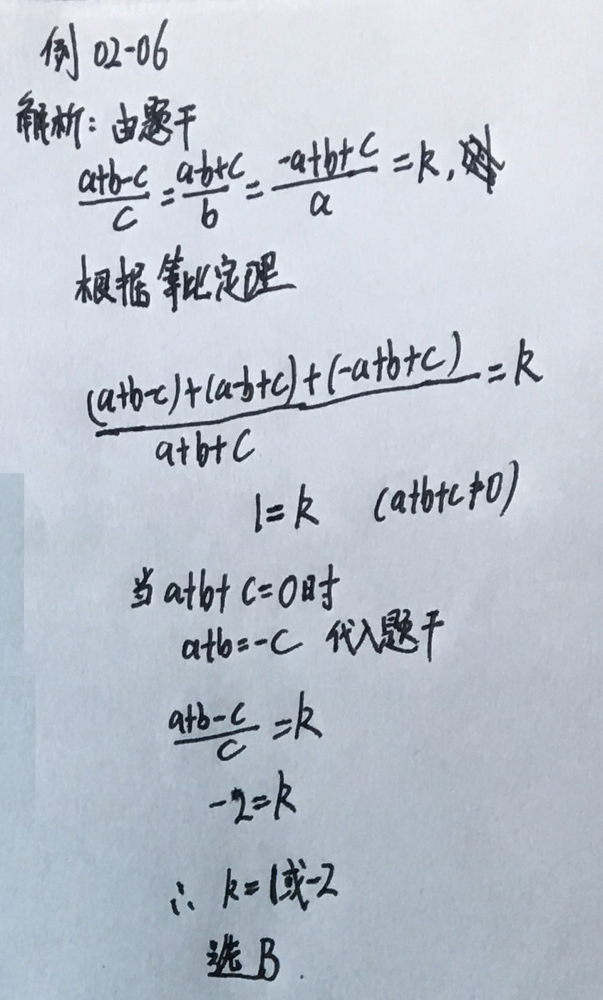

 

__例02-07：若实数a,b,c满足`a:b:c=1:2:5`且a+b+c=24则a^2+b^2+c^2=24,则a^2+b^2+c^2=?__  
A. 30       B.90        C.120        D.240        E.270

  解析过程如下图：   
  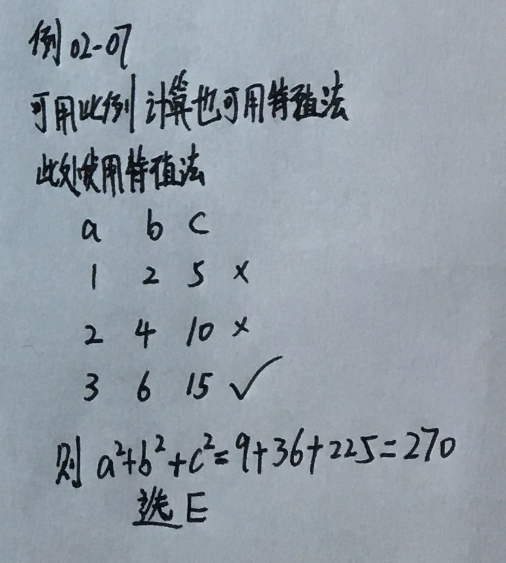

 

__例02-08：已知x/3=y/5, 则(x+y)/(x-y)的值是？__  
A. 5       B.-5        C.4        D.-4        E.以上答案均不正确

  解析过程如下图：   
  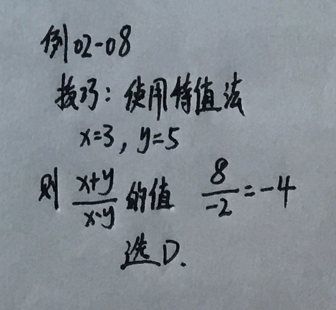

 

__例02-09：已知y与x-1成正比，比例系数为k1, y又与x+1成反比，比例系数为k2, 且k1:k2=2：3, 则x的值为__  
A. ±√15/3       B.√15/3        C.-√15/3        D.±√10/2        E.√10/2

  解析过程如下图：   
  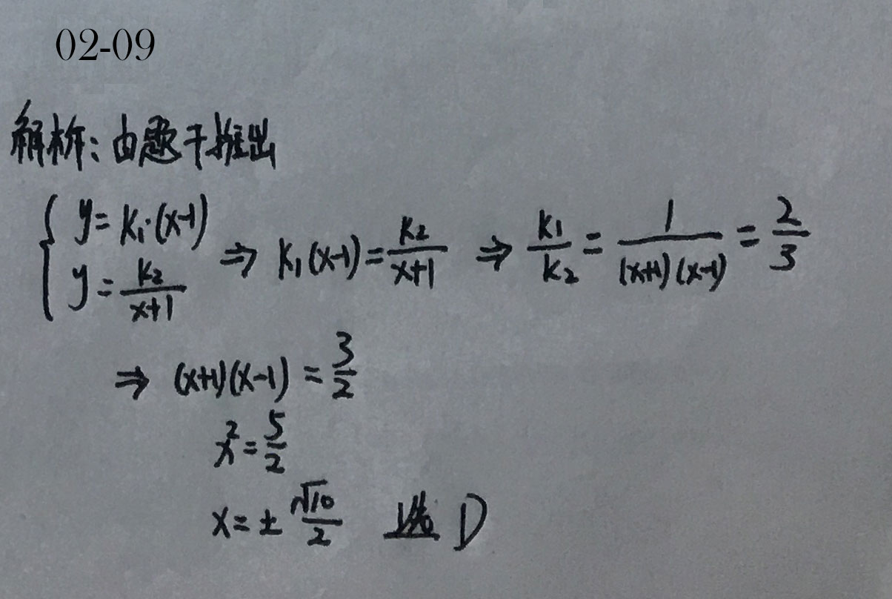

 

### __算术平均值__

   
  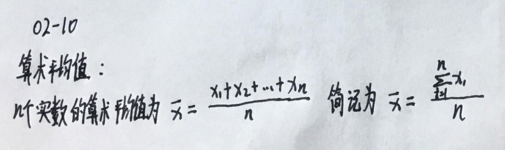

 

### __几何平均值__

   
  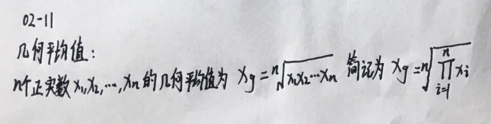

 

注意：几何平均值只对正实数有定义，而算术平均值对任何实数都有定义。

### __平均值相关定理__

#### 基本定理

   
  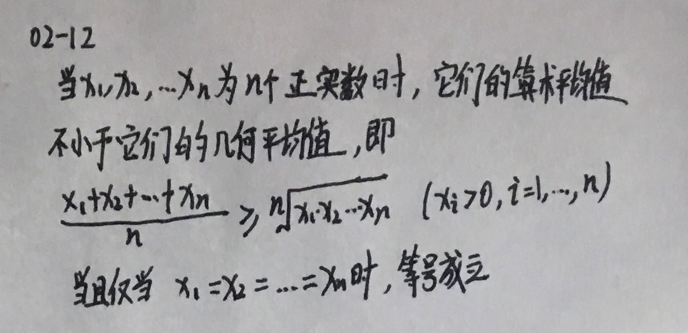

 

#### 常用的基本不等式

   
  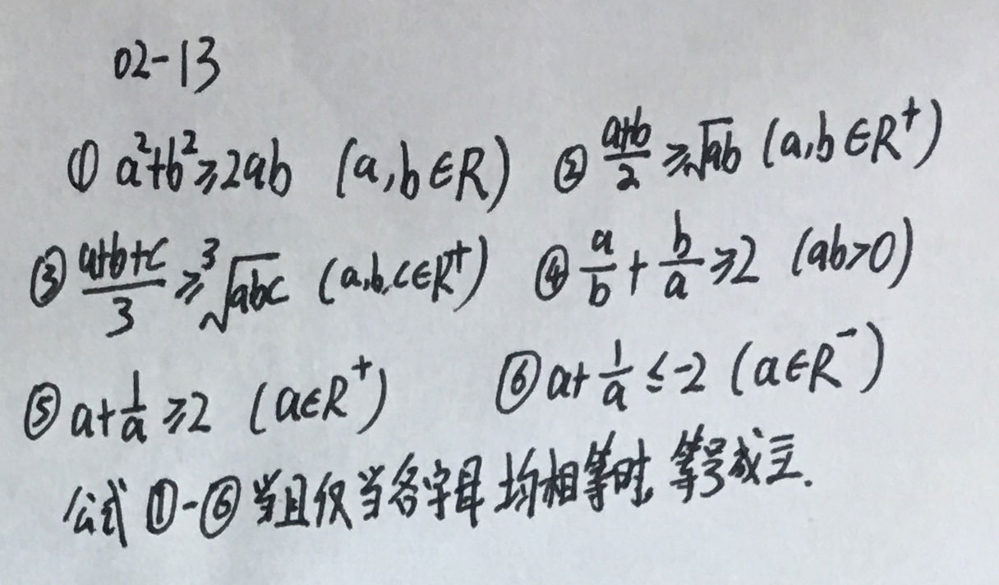

 

#### 配套练习
__02-14：x,y的算术平均值是2，几何平均值也是2，则 1/√x 与 1/√y的几何平均值是？__  
A. 5       B.√2       C.√2/3       D.√2/2        E.以上均不正确

  解析过程如下图：   
  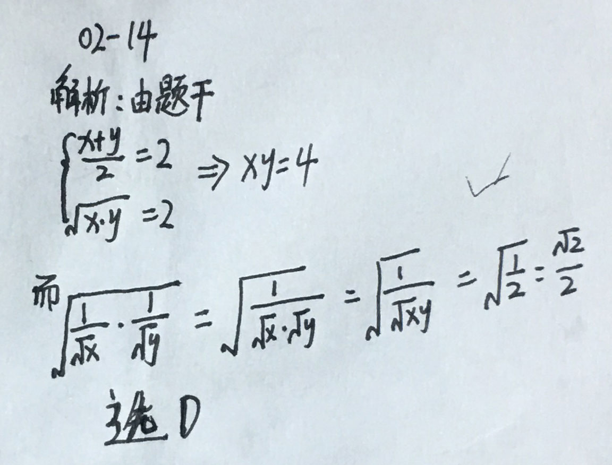

 

### __实数的绝对值的定义__

  实数a的绝对值定义为：   
  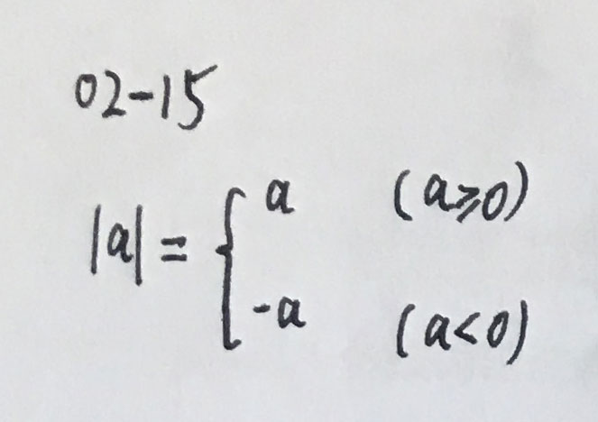

 

### __绝对值的几何意义__
实数a在数轴上对应一点，这个点到原点的距离就是a的绝对值

   
  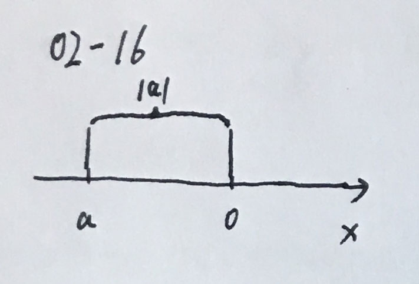

 

### __绝对值的性质__
#### 非负性：
任何实数a的绝对值非负，即|a| >= 0

归纳：所有非负性的变量 
1. 正的偶数次方(或根式) : a^2, a^(1/4) >=0  
2. 负的偶数次方(或根式) : a^(-2), a^(-1/4) >0  

规则：若干个具有非负性质的数之和等于零时，则每个非负数必然为零。
例如：若 |a| + b^2 + √c = 0, 则 a = b = c = 0

#### 对称性
互为相反数的两个数的绝对值相等， 即 |-a| = |a|

#### 自比性

   
  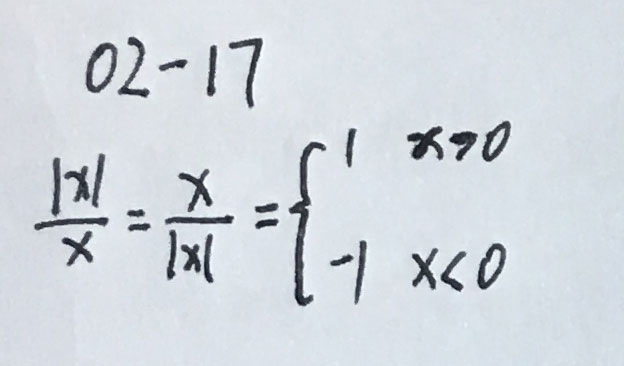

 

#### 相关例题
__02-18：代数式|a|/a + |b|/b + |c|/c的可能取值为：__  

  解析如下：   
  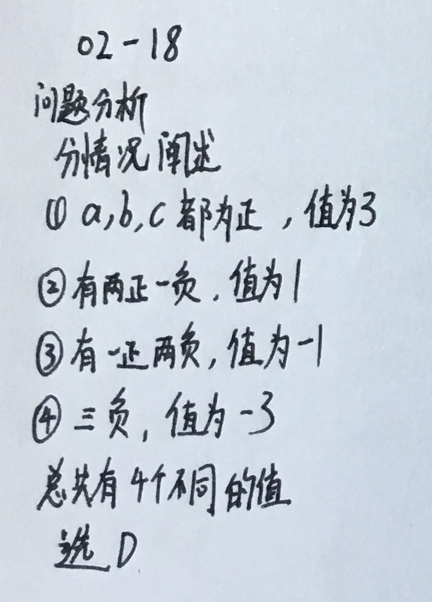

 

#### 自比性问题的关键是判断符号，因此需要掌握以下几个表达式
- abc > 0, 说明a,b,c中有三正或两负一正
- abc < 0, 说明a,b,c有三负或两正一负
- abc = 0, 说明a,b,c中至少有一个为0

#### 等价性
- |a| = √(a^2)
- |a|^2 = a^2
- 常用等价性质来去除"| |"

#### 绝对值不等式性质与运算法则
- |a|<=b (b>0) <=> -b <= a <= b
- |a|>=b (b>0) <=> a<=-b 或 a >= b
- |a*b| = |a| * |b|

#### 三角不等式
- |a+b| <= |a| + |b| (ab >=0时等号成立)
- |a| - |b| <= |a+b| (ab<=0且|a|>=|b|时等号成立)
- |a-b| <= |a| + |b| (ab <=0 时等号成立)
- |a|-|b| <= |a-b| (ab>=0且|a|>=|b|时等号成立)

#### 相关例题
__02-19：y=|x-2|求最大值：__  

  解析如下：   
  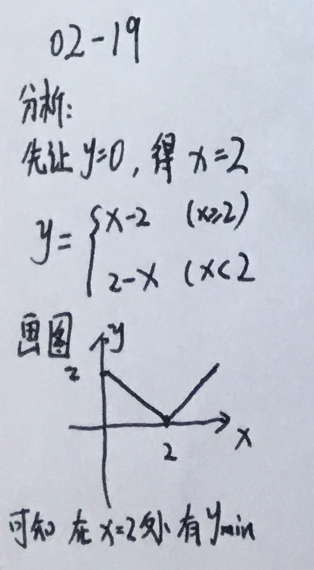

 

__02-20：分析 y=|x-2| + |x+2|：__  

  解析如下：   
  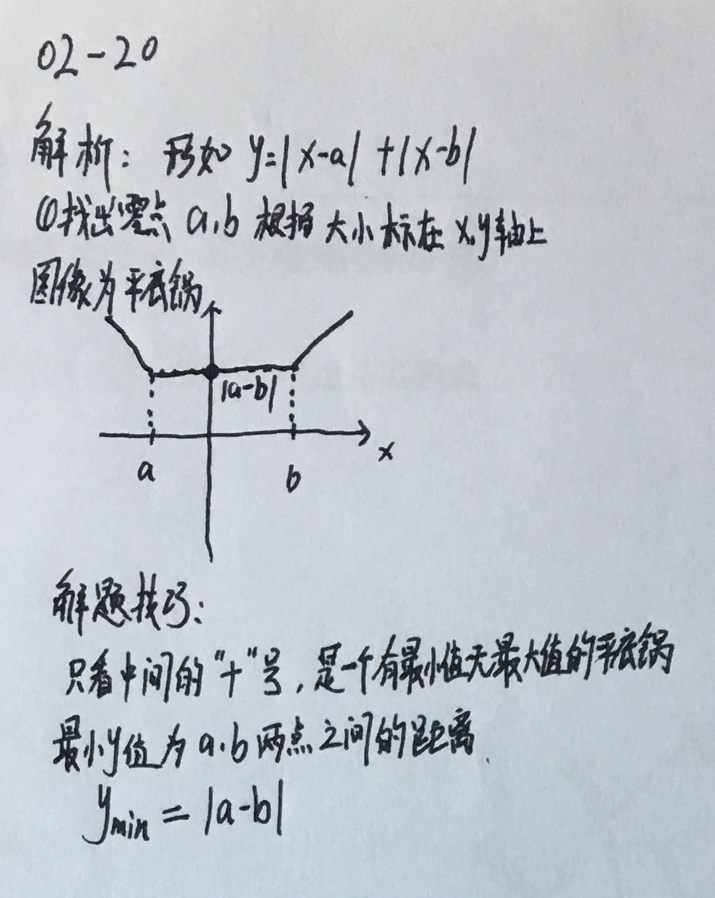

 

