### __代数式的分类__

### __整式及其运算__

#### __定义__ ：
在有理式中，没有除法运算或有除法运算但除式中不含字母的式子叫整式。
整式包含单项式和多项式，其和、差、积、商仍为整式。

#### __运算__ ：

##### __加减运算__ ：
几个整式相加减，有括号的先去括号，然后合并同类项。整式加法满足交换律、结合律、对乘法的分配率
  
__整式加减法的运算步骤：__ 
1) 去括号 
2) 合并同类项 

 

 
  总结如下：   
  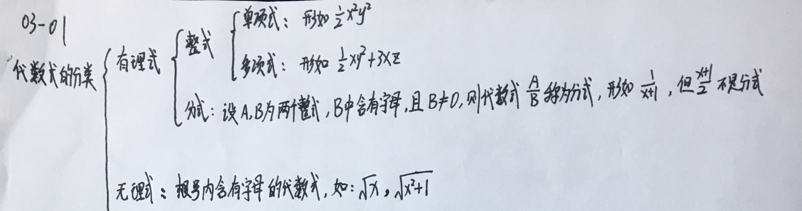

 

##### __乘法运算__ ：

__乘法的运算步骤：__ 
1) 一个因式的每一项乘以另一个因式的每一项 
2) 合并同类项 
 

 
  举例说明：   
  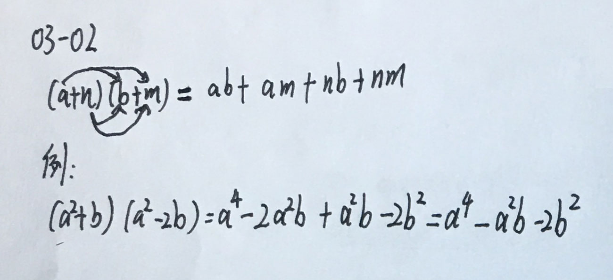

 

##### __基本公式整理__ ：

 
  举例说明：   
  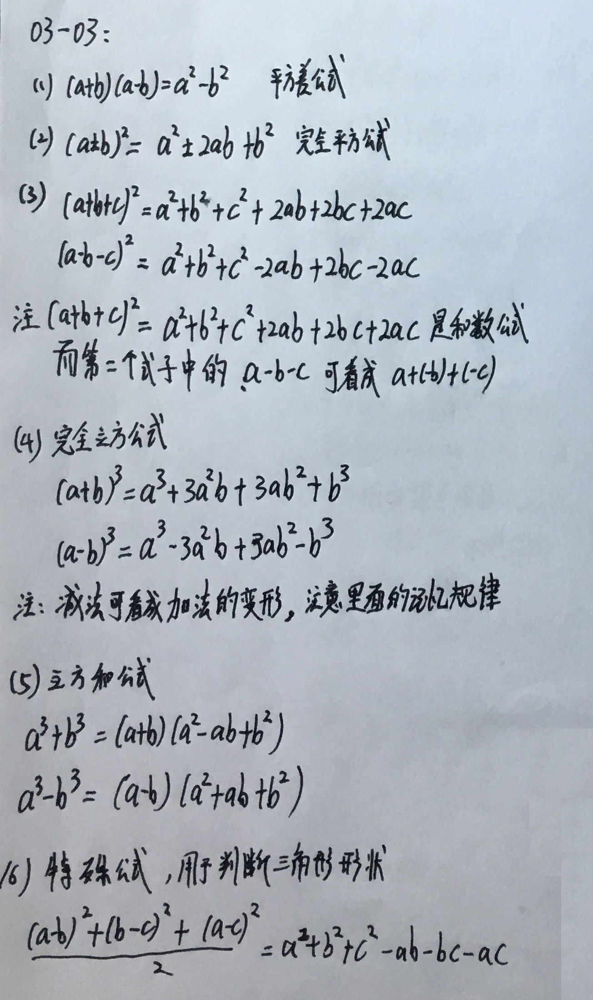

 

##### __相关例题__ ：
__03-04：ΔABC的三边a,b,c满足a^2+b^2+c^2=ab+ac+bc,则ΔABC为？ __  

 
  举例说明：   
  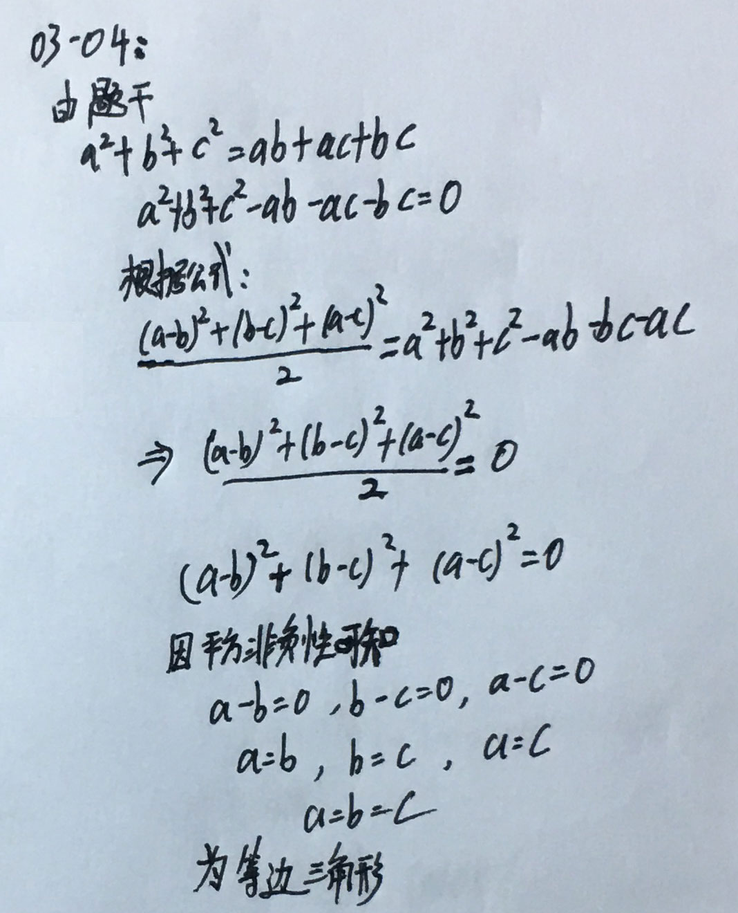

 

##### __除法运算__ ：

 
  多项式除法：   
  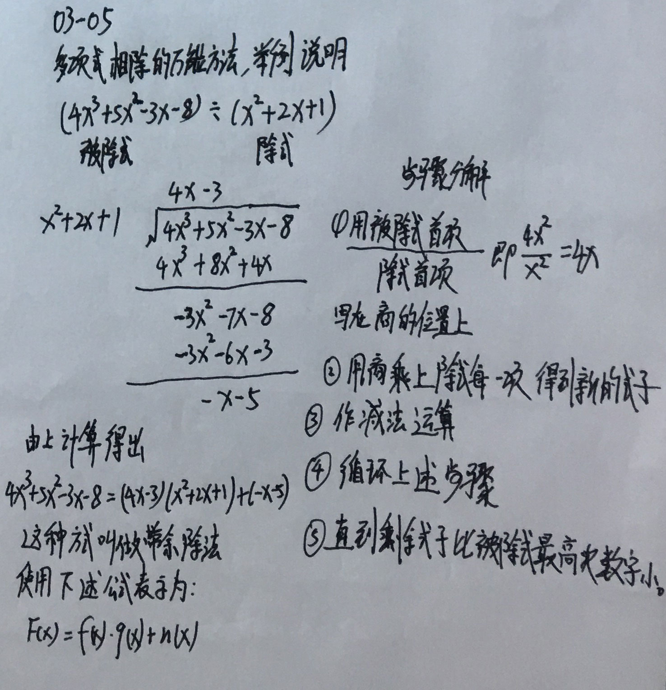

 

##### __余式定理的使用范围__ ：

 
  余式定理的使用范围：   
  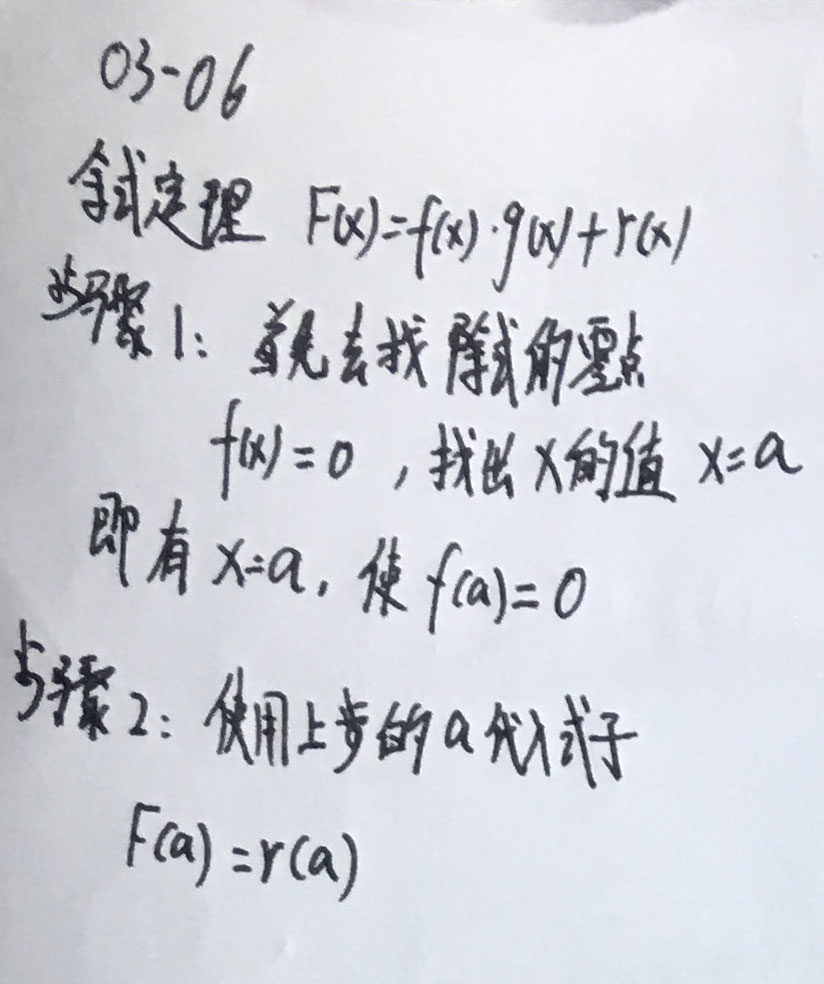

 

##### __因式定理的使用范围__ ：

 
  因式定理的使用范围：   
  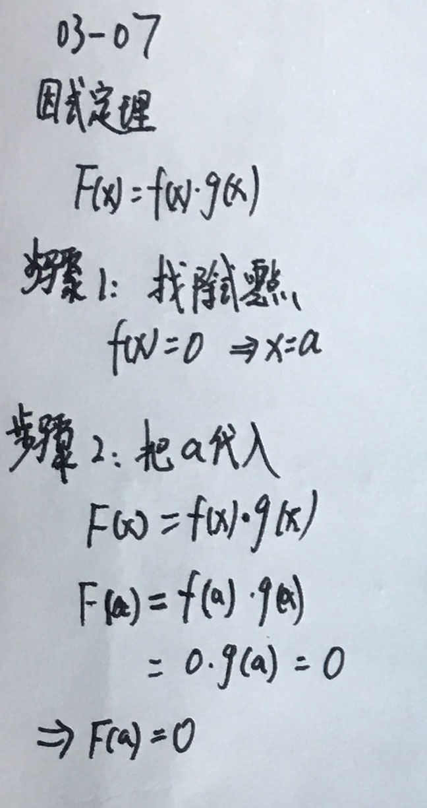

 

##### __相关例题__ ：
__例03-08 若x^3+x^2+ax^2+b能被x^2-3x+2整除，则a,b各是多少 ：__ 

 
  分析如下：   
  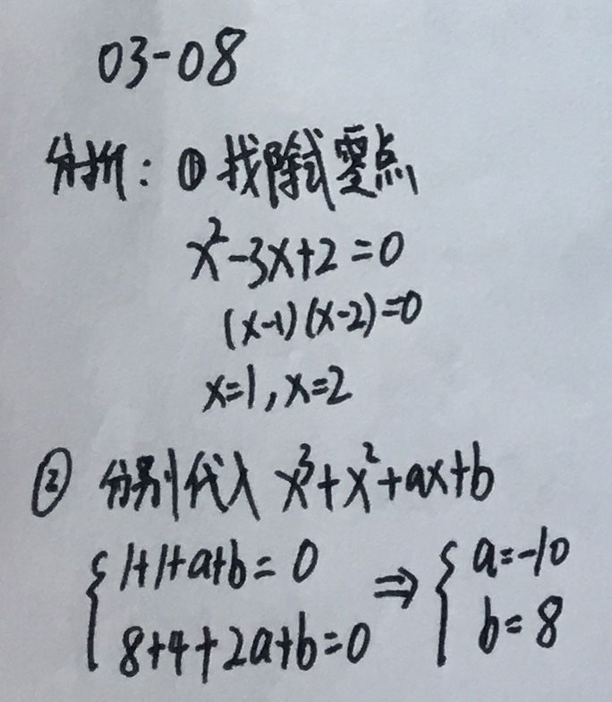

 

__例03-09 若多项式f(x)=x^3 + a^2*x^2+x-3a能被x-1整除，求实数a__ 

 
  分析如下：   
  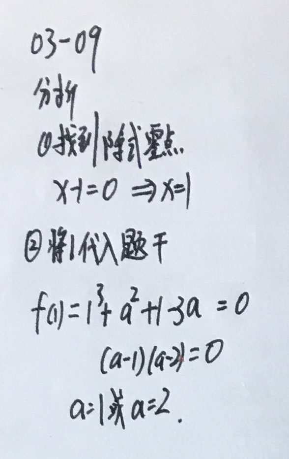

 

##### __因式分解__ ：
就是把一个多项式分解成几个整式乘积的形式。 

 
  常见的因式分解：   
  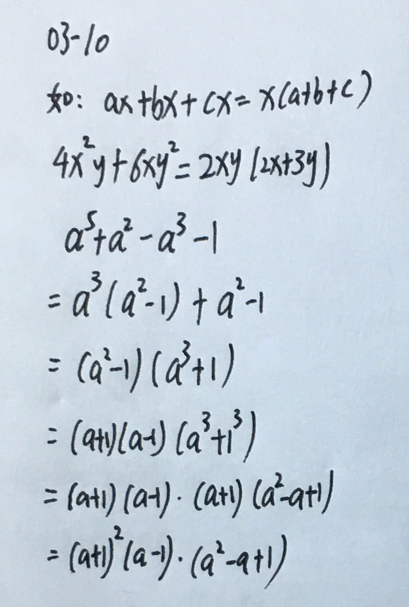

 

##### __因式分解中的十字相乘法__ ：

 
  十字相乘法分析：   
  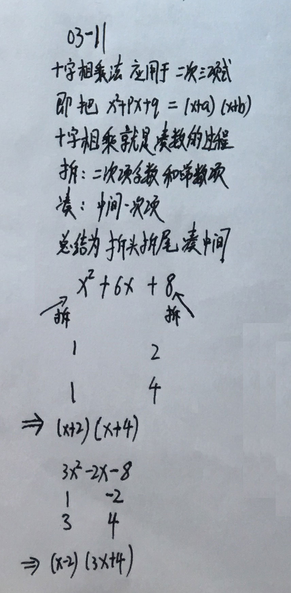

 

##### __求根法__ ：

 
  关于求根法：   
  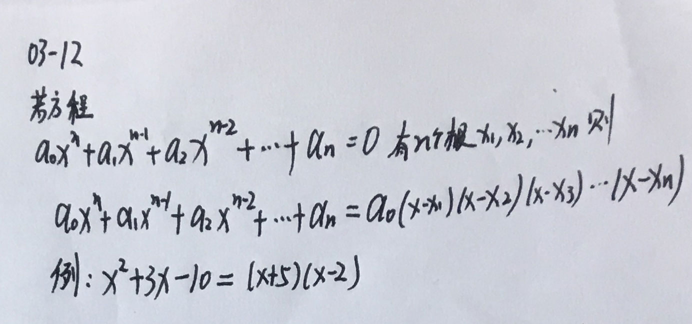

 

##### __待定系数法__ ：

 
  关于待定系数法：   
  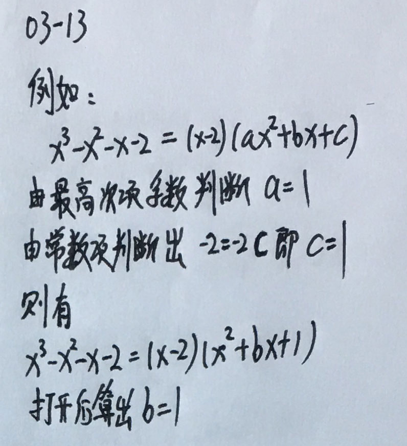

 

##### __分式及运算__ ：

 
  图解说明：   
  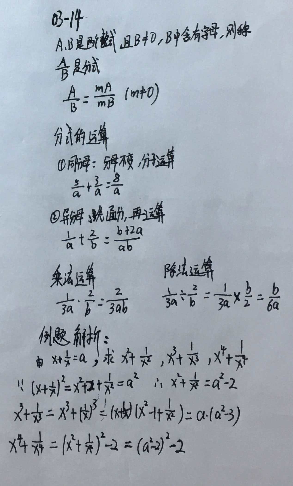

 
