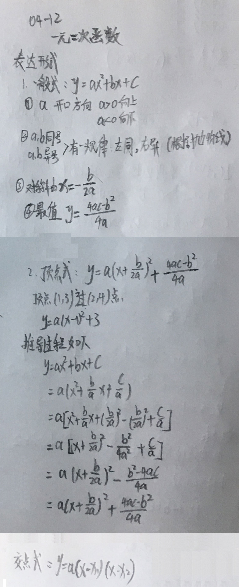
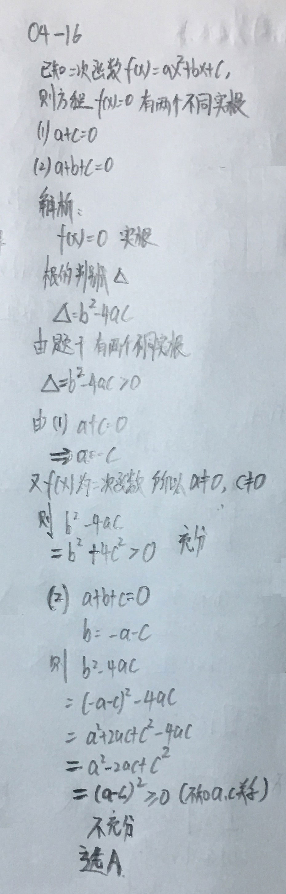

###__例题复习__

__例题：04-01__ 

  分式的幂运算：   
  

 

__例题：04-02__ 

  条件充分性判断   
  

 

__04-03：关于1/a+1/b+1/c=0的问题__ 

  举例说明：   
  

 

__04-04：04-03相关例题1__ 

  举例说明：   
  

 

__04-05：04-03相关例题2__ 

  举例说明：   
  

 

__04-06：关于高次代数式的问题__ 

  迭代降次，举例说明：   
  

 

__04-07：条件充分性判断相关例题：__ 

  涉及到x,y,z的分式   
  

 

__04-08：二次项系数的因式分解：__ 

  求零点，带入法   
  

 

###__集合的区间表示__

  求零点，带入法   
  

 

###__常见的一元一次函数__

  求零点，带入法   
  

 

###__相关例题__

__04-11：直线过某一象限：__ 

  相关例题   
  

 

###__关于一元二次函数__

  一般式，顶点式，交点式   
  

 

###__一元二次函数的相关例题__

__04-13关于一元二次函数的充分必要条件：__ 

  单调递增   
  

 

__04-14关于一元二次函数的最大值：__ 

  使用最大值公式   
  

 

__04-15关于一元二次函数中的对称轴和过一点求值：__ 

  使用最大值公式   
  

 

__04-16关于一元二次函数中的有不同实根问题：__ 

  使用最大值公式   
  

 

__04-17关于一元二次函数中确定abc三值的条件充分性判断：__ 

  确定a,b,c的值   
  

