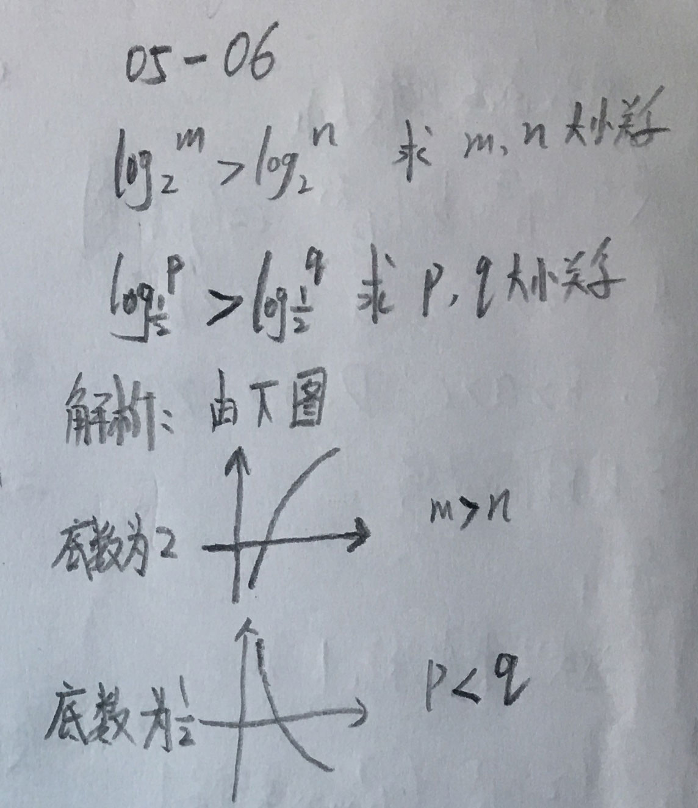
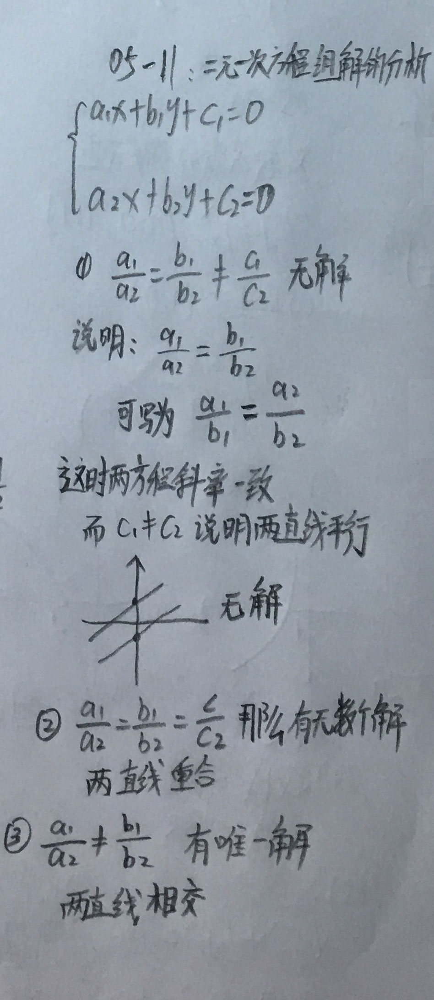
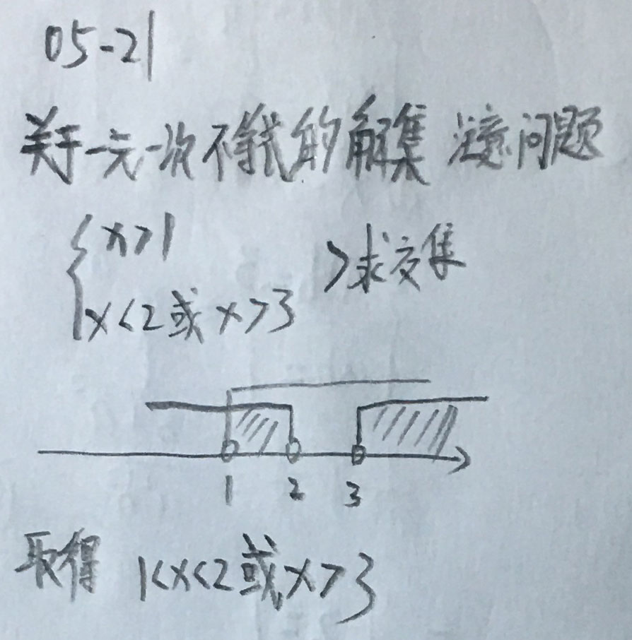

### __指数函数__

  

 

### __指数函数比较大小__

__05-02：比较大小相关例题__ 

  

 

__05-03：比较大小相关例题__ 

  

 

### __对数函数__

__05-04：引入对数函数__ 

  

 

__05-05：对数函数的研究范围：__ 

  

 

__05-06：对数函数相关例题：__ 

  

 

__05-07：对数函数的换底运算：__ 

  

 

__05-08：对数函数相关例题：__ 

  

 

__05-09：对数函数的比较大小：__ 

  

 

### __方程__

__05-10：一元一次方程和二元一次方程组：__ 

  

 

__05-11：解二元一次方程组分析：__ 

  

 

__05-12：解二元一次方程组例题：__ 

  

 

__05-13：一元二次方程的求根公式：__ 

  

 

__05-14：方程与函数之间的关系：__ 

  

 

__05-15：根与系数之间的关系：__ 

  

 

__05-16：韦达定理相关例题：__ 

  

 

__05-17：一元二次方程组公共根例题：__ 

  

 

__05-18：一元二次方程组的公共根问题：__ 

  

 

__05-19：关于一些不等式的性质：__ 

  

 

__05-20：关于一元一次不等式：__ 

  

 

__05-21：关于一元一次不等式的解集：__ 

  

 

__05-22：关于一元二次不等式的解：__ 

  

 

__05-23：关于一元二次不等式恒成立问题：__ 

  

 

__05-24：关于一元二次不等式相关例题：__ 

  

 
